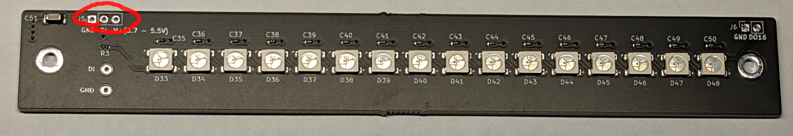

# 16LEDs-san

## PCB board with 16 NeoPixel LEDs

16-LEDs-san is a handy PCB with 16 cascaded neopixel-comapible LEDs.
You can also cascade same PCBs.
It is useful for the MCUs that have a few GPIOs.

## Kit contents

- Pre-assembled circuit board
- 1x3 pin socket

## How to assemble

Solder the included 1x05 pin socket into the following place below:

## Sample program

There are no specific sample software for the PCB. Please refer to the NeoPixel software implementations.
