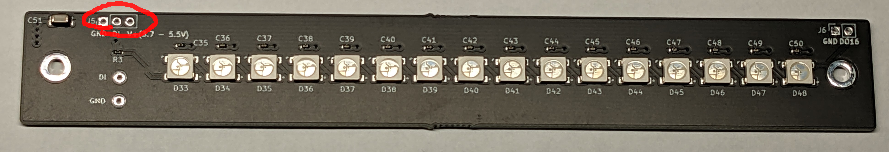

# 16LEDさん

## NeoPixelのLED16個の基板

16LEDさんは16個のNeoPixel互換のフルカラーLEDで構成された便利な基板です。別の基板にカスケード接続することもできます。
ピン数が少ないマイコンボードでも、ピン1本でLEDを(処理できる範囲で)いくらでも増やすことができます。

## キットに含まれているもの

- 組みたて済みの基板
- 1x3 ピンソケット

## 組みたてかた

赤い枠でかこまれた部分に、付属の1x3のピンソケットをはんだづけします。

## サンプルプログラム

特にありません。Adafruitのneopixelのソフトを参考にしてください。
